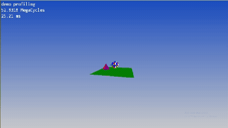

# Vgengine

Vgengine is a custom C++ software rasterizer with game engine tools built from scratch on top of the Win32 API.

## Demo

## Features

- Custom memory allocators: Arena, Scratch, Pool.
- Custom data structures: static array, dynamic array, hash table, bit array, string.
- Lock-free job queue
- Profilers with nesting
- Linear algebra: Vectors, Matrices, Quaternions
- DLL hot-reloading
- Keyboard and mouse input handling
- Font bitmap atlas creator and loader
- Virtual camera movable in 3D
- Mesh rasterization with clipping, culling, z-buffering
- Bitmap font rendering with texture-filtered glyphs

## Building

The project is built with a batch file build.bat using a unity build, avoiding build systems and linker complexity.

Build variables:
- OPTIMIZATIONS
- DEVELOPER (for debug only functionality)
- USE_DLL

The project.h file defines the virtual root and folder structure for the project. It also has the ability to make a font atlas asset once, specified by name and font size.

## DLL hot-reloading

To be able to implement this functionality the executable owns all memory in one block and passes the pointer to it to the DLL when reloading. This is the only global variable and only static memory DLL owns. The functions DLL provides have name mangling turned off so they can be exported to the executable.

## Architecture

For portability create a platform specific file that implements the platform.h interface, then create a game loop and call engine.h functions, which are:

- platform_init_memory_base: sets the base pointer of the memory block
- platform_init_engine: called once before game loop to initialize engine state
- update_and_render: runs the main engine code inside the game loop

## Memory management

Memory is divided into two segments, permanent memory and frame local memory. At the head of the memory block is the Globals struct which holds information about how the memory is organized. Permanent memory lives for the duration of program and is held inside Engine_state struct. Frame local memory is reset every frame.

## Threading

A lock-free job queue distributes jobs submitted by the main thread to worker threads using atomic instructions and memory barriers. The main thread should wait after submitting jobs for workers to finish.

## Input

In Win32 the window procedure will process key and mouse messagess by properly toggling flags for the current frame which can later be inspected in the engine to do fine-grained processing of input anywhere. The engine also has information about the cursor position.

## Camera

The virtual camera looks down negative Z axis, it is described by nearclip and farclip Z values. The projection canvas is positioned at (0,0,-1) in camera space, and the eye of the camera is positioned at the origin. The aspect ratio is one, which means only one FOV parameter describes the camera.

## Graphics

### Projection

Each mesh has an associated Transform which is converted to a 4x4 matrix and multiplied with the view (camera) and projection matrices to form a unified MVP matrix. Vertices of the mesh are then converted into homogeneous coordinates and multiplied by MVP to convert them into clip space.

### Clipping and perspective divide

Triangles are clipped in homogeneous space using Sutherland-Hodgman algorithm. After clipping vertices are converted back to Euclidean space, implicitly doing the perspective divide, and multiplied by viewport dimensions to convert them to raster space.

### Rasterization

Rasterization is performed by iterating over pixels inside the triangle bounding box and doing an inside test. Barycentric coordinates of the pixel are calculated to find its Z value with perspective-correct interpolation to do z-buffering.